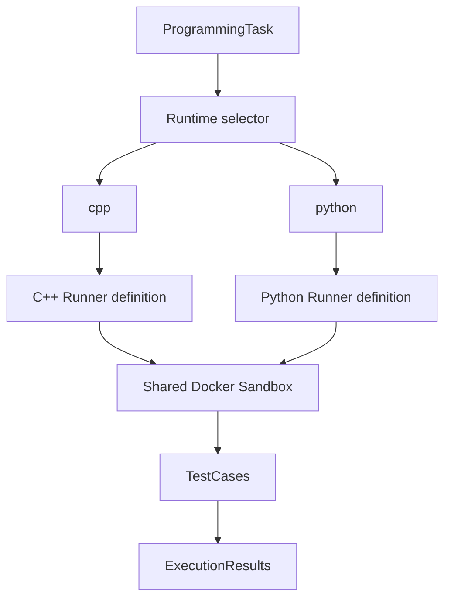

# Enhancement 5B: Python орындаушысы және екі тілдегі есептер

Бұл өзгеріс қолданыстағы ASP.NET Core MVC жобасын кеңейтеді. Identity, SQL Server, C++ judge, Lessons, AI Tutor және үш тілдегі интерфейс сақталды. Қолданба қайта құрылмады; жаңа микросервис немесе дерекқор схемасы қосылған жоқ.

## 1. Python орындаушысы не үшін қосылды?

Студент бір есепті C++ 20 немесе Python 3 арқылы шеше алады. Екі тілде де уақытша Run, ресми Submit, ашық/жасырын тесттер, әрекет тарихы және AI кеңестері бар. Есептің шарты мен жауабы программалау тіліне тәуелсіз.

## 2. C++ және Python архитектурасы қалай бөлінеді?

`RunnerLanguage` екі сенімді анықтаманы сақтайды: image, бастапқы файл атауы, компиляция/синтаксис аргументтері, орындау аргументтері және бастапқы үлгі. `DockerCodeRunner` контейнер шектерін, ағындарды, timeout, OOM тексеруін және тазалауды ортақ қолданады. C++ бұрынғы GCC командасымен орындалады; Python сол механизмге қосылды.



Браузерден келген RuntimeId сервердегі қосулы Runtime жазбасымен тексеріледі. Осыдан кейін ғана LanguageKey бекітілген анықтамаға сәйкестенеді. Run және Submit бір `SubmissionExecutionGate` қолданады.

## 3. Runtime LanguageKey деген не?

`cpp` және `python` — сервер қабылдайтын нақты кілттер. Олар аударылмайды. Runtime атауы, мысалы `Python 3`, интерфейсте көрсетіледі. Танылмаған не өшірілген Runtime қабылданбайды. Браузер жіберген қосымша `LanguageKey` орындаушыны таңдай алмайды.

`DbSeeder` Development ортасында `python` кілті жоқ болса ғана бір Runtime қосады: Name=`Python 3`, Version=`3.13.16`, FileExtension=`.py`, IsEnabled=true. Бар Runtime метадеректері өзгертілмейді.

## 4. Неге DB command string орындалмайды?

`Runtime.CompileCommand`, `RunCommand`, `DockerImage` және `FileExtension` — метадеректер. Docker аргументтері тек `RunnerLanguage` және ортақ runner арқылы құрылады. Тексеру кезінде Python Runtime өрістеріне жалған команда, image және кеңейтім жазылды: орындау әлі де бекітілген Python арқылы өтті; соңында бастапқы метадеректер қалпына келтірілді.

## 5. Python Docker image қалай таңдалды?

2026-10-02 күні ресми Debian Bookworm slim нұсқасы нақты жүктелді:

```powershell
docker pull python:3.13-slim-bookworm
docker image inspect python:3.13-slim-bookworm --format '{{json .RepoDigests}}'
```

Шектеулі контейнердегі `python3 -I -S -B --version` нәтижесі: **Python 3.13.16**. `/usr/bin/timeout --version` GNU coreutils 9.1 екенін көрсетті. Бұл жоба барлық жаңа Python нұсқаларын автоматты түрде қолданбайды; таңдалған 3.13 желісінің нақты image-і бекітілді.

Таңдау негізі: [ресми Python image](https://hub.docker.com/_/python) және [3.13 slim-bookworm Dockerfile](https://github.com/docker-library/python/blob/master/3.13/slim-bookworm/Dockerfile).

## 6. Docker digest pinning деген не?

Tag уақыт өте басқа image-ке ауысуы мүмкін. Digest нақты мазмұнды белгілейді. Жүктеуден кейін алынған және серверде сақталған толық Python reference:

```text
python@sha256:5024f48ba9441d4b13a95d3945abc6365538e3a31109833367a1923523c6efed
```

GCC reference өзгерген жоқ:

```text
gcc@sha256:5e927c284bf55a7dc796262e311a0703344f62f41f5621eb56843111b1d37e15
```

Runner алдымен осы reference-тің жергілікті image ID мәнін тексеріп, контейнерге сол ID береді. `--pull never` қолданылады. Image жоқ болса mutable tag немесе host орындаушысына ауысу болмайды. Әр тілдің денсаулық нәтижесі 15 секундқа бөлек кэштеледі.

## 7. main.py қалай жасалады?

Сервер `IntelligentProgrammingPlatformRunner/<server-guid>/source/main.py` файлын жасайды. GUID, файл атауы және mount жолы студенттен алынбайды. SourceCode тек файлға жазылады; shell жолына немесе Docker командасына енгізілмейді. Python контейнеріне тек осы source бумасы `/app:readonly` түрінде жалғанады.

Python-ға build бумасы жалғанбайды. Project root, Docker socket, пайдаланушының home бумасы, SQL файлдары және құпиялар mount етілмейді. Жұмыс аяқталғанда немесе сұрау үзілгенде контейнер мен уақытша workspace тазаланады.

## 8. Python syntax check қалай орындалады?

Shell қолданылмайды. Бекітілген аргументтер:

```text
/usr/local/bin/python3 -I -S -B -X pycache_prefix=/tmp/pycache -m py_compile /app/main.py
```

Оны контейнердегі GNU timeout 15 секундпен шектейді; host watchdog қосымша қорғаныс береді. Синтаксис контейнері 512 MB жад, 1 CPU және 128 MB tmpfs шектерін қолданады. Қате шықса ресми тесттер орындалмайды.

## 9. py_compile деген не?

`py_compile` Python файлын байт-кодқа компиляциялап, синтаксистің жарамдылығын тексереді. Студенттің `print` не файл жазу сияқты top-level нұсқаулары орындалмайды. `-X pycache_prefix=/tmp/pycache` осы тексерудің `.pyc` файлын тек контейнердің уақытша жадына бағыттайды. `-B` қалыпты import байт-кодын жазуды тоқтатады; ол `py_compile` үшін жалғыз қорғаныс емес.

Нақты C# тексеруі host workspace ішінде тек `main.py` қалғанын, `.pyc` және executable болмағанын тексереді. [py_compile құжаттамасы](https://docs.python.org/3.13/library/py_compile.html), [Python іске қосу параметрлері](https://docs.python.org/3.13/using/cmdline.html).

## 10. Неге SyntaxError CompilationError болып көрсетіледі?

Judge үшін бұл — бағдарламаны тесттеуге дайындау кезеңіндегі қате. Сондықтан бұрынғы `SubmissionStatus.CompilationError`, `CompileSucceeded=false` және `CompilerOutput` өрістері қолданылады. ExecutionResults тесттері `Skipped` күйінде сақталады. Дерекқор бағандарын қайта атау немесе migration жасау қажет емес.

## 11. Python кодына STDIN қалай беріледі?

Сәтті синтаксис тексеруінен кейін әр TestCase жаңа контейнерде орындалады:

```text
/usr/local/bin/python3 -I -S -B -u /app/main.py
```

`docker start --attach --interactive` ағынына тесттің Input мәні беріледі. Run үшін дәл осылай CustomInput беріледі. `-u` stdout/stderr буферлеуін азайтады. Екі іске қосу арасындағы `/tmp` файлдары сақталмайтыны тексеріледі.

## 12. STDOUT және STDERR қалай алынады?

Ортақ `DockerCli` екі ағынды шектеулі түрде оқиды. ExitCode және Docker State уақыттары тіркеледі. Диагностикадағы host workspace жолдары жасырылады; `/app/main.py` қысқа `main.py` ретінде көрсетіледі. SourceCode Razor арқылы кодталады, JavaScript оны textarea/value арқылы оқиды.

Жауапты салыстыру C++ ережесін сақтайды: CRLF/CR → LF, кейін тек `TrimEnd`. Бастапқы бос орын маңызды. Custom Run жауабы ресми ExpectedOutput-пен салыстырылмайды.

## 13. Time limit қалай жұмыс істейді?

Task.TimeLimitMs серверде 100–30000 ms аралығына шектеледі. Контейнердегі GNU timeout және оған қосымша 5 секундтық host watchdog қолданылады. Ресми Submit-тің жалпы бюджеті 180 секунд, Run бюджеті 90 секунд. Execution CPU шегі — 0.5 CPU.

Шексіз Python циклі нақты Submit пен Run сынақтарында `TimeLimitExceeded` болды. Stdout/stderr 64 KiB шегінен асса контейнер тоқтатылып, қауіпсіз `RuntimeError`/output-limit нәтижесі беріледі. Source — 64 KiB, CustomInput — 32 KiB UTF-8.

## 14. Memory limit қалай жұмыс істейді?

Task.MemoryLimitMb 16–1024 MB аралығына шектеледі. `--memory` және `--memory-swap` бірдей; қосымша swap бюджеті берілмейді. Execution tmpfs шектеулі, root filesystem read-only. Docker `State.OOMKilled=true` деп растағанда ғана OOM `MemoryLimitExceeded` болып белгіленеді.

Нақты Python жад өсіру сынақтарында Submit және Run **MemoryLimitExceeded** берді. `MemoryUsedKb` сенімді өлшенбегендіктен NULL қалды; ойдан алынған peak memory көрсетілмейді. Python өзі `MemoryError` беріп, Docker OOM растамаса, бұл әдеттегі runtime қатесі болуы мүмкін.

## 15. Network неге өшірілген?

Барлық контейнерге `--network none` қойылады. Қауіпсіз сынақ 1.1.1.1:443 адресіне 0.5 секундтық timeout арқылы қосылуға тырысты және желі қолжетімсіз екенін растады. Image жүктеу — әкімші дайындауы; студент коды image жүктемейді және желіні қоса алмайды.

## 16. Неге pip/package install жоқ?

Бұл кезең тек стандартты кітапхананы қолдайды. `requirements.txt`, студент сұратқан `pip install` және интернеттен тәуелділік жүктеу функциялары жоқ. `-S` site-packages автоматты қосылуын тоқтатады; `-I` user site, PYTHON* орта ықпалын және script каталогының әдеттегі sys.path қосылуын оқшаулайды.

Бұл Python модульдерін жеке allowlist арқылы шектейтін жүйе емес. Қауіпсіздік шекарасы — Docker: желі жоқ, root read-only, non-root user, ресурс шектері. Қолданба host environment-ті контейнерге көшірмейді. Image ішіндегі ашық signing fingerprint `GPG_KEY` құпия credential емес.

## 17. Standard library деген не?

Python құрамындағы кітапханалар: мысалы `math`, `sys`, `os`. Нақты `math.isqrt` және `sys.stdin` сынақтары өтті. Барлық optional немесе жүйелік тәуелділігі бар модульдердің жұмысын уәде етпейміз. `os` қолжетімді болуы host файлдарына құқық бермейді: процесс контейнер шекарасында қалады.

## 18. Python RuntimeError қалай анықталады?

| Себеп | Нәтиже |
|---|---|
| Синтаксис қатесі | CompilationError |
| Жауап сәйкес емес | WrongAnswer |
| Ұсталмаған exception / кәдімгі нөлден өзге exit | RuntimeError |
| Уақыт шегі | TimeLimitExceeded |
| Docker растаған OOM | MemoryLimitExceeded |
| Docker/image инфрақұрылымы қолжетімсіз | InternalError |

Output-limit тексеруі мен Docker OOM тексеруі әдеттегі exit-code жіктеуінен бұрын қолданылады. Hidden тесттің stderr, input және жауаптары студент бетіне не AI input-қа шығарылмайды.

## 19. C++ және Python неге бір semaphore қолданады?

Екі тіл бөлек екі slot алса, жүйе төрт job орындай алар еді. Сондықтан Run және Submit бір singleton gate-тің **екі slot-ын** бөліседі. Нақты қатар сұрауларда C++ және Python, Run және Submit араластырылды; тірі контейнерлердің максимумы 2 болды. Бұл бір ASP.NET процесіне арналған шек; бірнеше replica үшін таратылған queue бұл жұмыстың ауқымына кірмейді.

## 20. Custom Run Python-да қалай жұмыс істейді?

Source және CustomInput тексеріледі → сенімді runtime таңдалады → ортақ gate → Docker syntax check → бір execution контейнері → JSON жауап. Submission, ExecutionResult, AI Feedback, Progress және Leaderboard өзгермейді. Run топтамасына дейінгі/кейінгі кесте hash мәндері салыстырылды. Сұрауды үзу де workspace пен контейнерді тазалайды.

## 21. Monaco language қалай ауысады?

Жергілікті bundle Python tokenizer-ін қосады. Runtime option ішінде сервер дайындаған `data-language` және generic starter бар. Таңдау өзгергенде `monaco.editor.setModelLanguage` cpp/python тілін ауыстырады; бүкіл бет қайта жүктелмейді. Қате/белгісіз кілт үшін plaintext қолданылады.

CSP бұрынғыдай local assets, worker және nonce қолданады. Script `unsafe-inline`, `unsafe-eval` немесе CDN қосылған жоқ. Екі stylesheet factory үшін nonce қорғанысы енді bundle-дің импортталған ортақ chunk-ында да тексеріледі.

## 22. C++/Python draft қалай бөлек сақталады?

Кілт бұрынғы account+task негізіне `:cpp` немесе `:python` жалғайды. Ескі C++ draft тек cpp кілтіне бір рет көшіріледі. Ауысар алдында ағымдағы мәтін сақталады; жаңа тілдің draft-ы болмаса өз starter-і алынады. Storage бұғатталса, бет ішіндегі Map екі draft-ты ауыстыру кезінде сақтайды.

Автоматты сценарий: cpp-code → Python starter → python-code → C++ cpp-code → Python python-code. Сервер validation қатесімен қайтқан SourceCode сақталған draft-пен жабылмайды. Run жүріп жатқанда selector уақытша бұғатталады, RuntimeId бұғаттаудан бұрын FormData-ға алынады.

## 23. AI Tutor programming language-ті қалай біледі?

`OpenAiTutorService` иесіне тиесілі Submission.Runtime.LanguageKey мәнін оқиды да, `RunnerLanguage` атауын AI input-қа береді. Python source ішіндегі «мен C++» сияқты нұсқау бұл өрісті өзгерте алмайды. Hidden мәндер бұрынғы SQL projection шекарасында қалады.

Offline клиентпен Python language, үш UI мәдениеті, hidden деректердің жоқтығы, бірінші hint, келесі hint ашу және сақталған feedback-ті қайта пайдалану тексеріледі. Дайын толық шешім бермеу жөніндегі trusted prompt және жауап validation сақталды. Бұл enhancement ақылы OpenAI сұрауын жібермейді.

## 24. Code Diff тілге қалай бейімделді?

Бір тілдегі екі attempt cpp немесе python highlighting қолданады. Әртүрлі тілдегі қолмен ашылған рұқсатты салыстыру plaintext және локализацияланған түсіндірме көрсетеді. Иесі және task сәйкестігі бұрынғыдай серверде тексеріледі.

Journey әр attempt Runtime атауын көрсетеді және алдыңғы сол runtime әрекетіне сілтейді; қажетті әрекет басқа бетте болса да табылады. Екі attempt-тің source-ы тек кодталған textarea арқылы беріледі. Басқа пайдаланушы source-ы ашылмайды.

## 25. Қандай үш жаңа есеп қосылды?

| Есеп / slug | Topic / деңгей | Келісім | Тест саны |
|---|---|---|---|
| Count Even Numbers / count-even-numbers | Arrays / Easy | N бүтін санның жұптарын санау; нөл мен теріс жұптар есептеледі | 2 ашық + 5 hidden |
| Palindrome Check / palindrome-check | Basics / Medium | Бос орынсыз lowercase a-z сөз; дәл YES немесе NO | 2 ашық + 5 hidden |
| Binary Search / binary-search | Algorithms / Medium | Өсу ретімен берілген distinct массив; ZERO-BASED index немесе -1 | 2 ашық + 6 hidden |

Барлығы Published, TimeLimitMs=2000, MemoryLimitMb=128. Шарттарда толық C++/Python шешімдері жоқ. Count Even тесттері all-even, all-odd, one-value, negative, zero; Palindrome тесттері yes/no, single, even/odd; Binary Search first/middle/last, absent, single және negative жағдайларын қамтиды.

## 26. Test cases неге programming language-ке тәуелсіз?

TestCase тек Input, ExpectedOutput, IsHidden және Order сақтайды. Бір ProgrammingTask-қа әр runtime-мен Submission жіберіледі. Admin CRUD-қа есептің тілдік көшірмелері қажет емес. Реті тұрақты 1..7, 1..7 және 1..8; visible мысалдар бірінші. `(ProgrammingTaskId, Order)` бірегейлігі сақталған.

## 27. Бір task-ты екі тілмен қалай шешуге болады?

Есеп бетін ашып, Language арқылы C++ 20 не Python 3 таңдайсыз. Generic starter есептің шешімін бермейді. Өз код пен custom input-ты Run арқылы тексеріп, ресми тест үшін Submit басасыз. Бір есепті екінші тілмен қайта қабылдату Progress/Leaderboard ұпайын қайталамайды.

Python Basics сабағы print/input, айнымалы, if/for/list қамтитын сәлемдесу мысалымен жаңартылды. Ол үш judged есептің шешімі емес. Seeder тек бұрынғы өзгертілмеген Summary+Content+CodeExample мәндерін танығанда осы үш өрісті жаңартады; Admin өзгерткен мәтінді сақтайды. Title, Order, CreatedAt және басқа сабақтар өзгермейді. Related tasks Topic арқылы таңдалады: Arrays → Count Even Numbers; Algorithms → Binary Search.

## 28. Қандай Python security тесттері жасалды?

`scripts/verify_enhancement5b.py` нақты HTTPS/SQL/Docker арқылы тексереді:

- Accepted, WrongAnswer, SyntaxError, exception, шексіз цикл және Docker OOM;
- үлкен stdout, stdin/standard imports, бастапқы бос орынның маңызды болуы;
- read-only `/etc` жазуының қабылданбауы, желінің жоқтығы;
- UID 65534, host secrets environment-ке берілмеуі, оқшауланған Python іске қосылуы;
- тірі контейнер mount/capability/network/memory/CPU/PID/tmpfs параметрлері;
- metadata tampering, өшірілген runtime, CSRF, owner және XSS шекаралары;
- екі тілге ортақ 2 slot, cancellation cleanup, Run-ның дерекқорға әсер етпеуі;
- үш жаңа есепте C++ Accepted, Python Accepted және Python WrongAnswer;
- Journey/Diff, тарих, score, Progress, Learning Map, Lessons және үш UI тілі.

`tests/Enhancement5bChecks` syntax check кодты орындамайтынын, host `.pyc` жоқтығын, әр контейнердің `/tmp` оқшаулығын, AI контекстін және тек Python қосулы болғандағы starter таңдауды тексереді. Қауіпті host payload немесе шектеусіз host процесс жасалмайды. Host-тағы Python тек HTTP/SQL/Docker тексеру harness-і; студент Python коды Docker ішінде ғана орындалады.

## 29. Қандай regression тесттері орындалады?

Өзгерістерге дейін барлық baseline өтті: build, EF current/no-pending, Docker, тоғыз HTTP suite, үш C# suite, екі Node suite, resource тексеруі және екі Docker-unavailable нұсқасы. Төмендегі командалар финалдық қайталанатын тексеруді береді; DB fixture suite-терін қатар жүргізбеңіз.

```powershell
python scripts/verify_phase2.py
python scripts/verify_phase3.py
python scripts/verify_phase4.py
python scripts/verify_phase5.py
python scripts/verify_enhancement1.py
python scripts/verify_enhancement2.py
python scripts/verify_enhancement3.py
python scripts/verify_enhancement4.py
python scripts/verify_enhancement5a.py
python scripts/verify_enhancement5b.py
dotnet run --project tests/Phase4Checks
dotnet run --project tests/Enhancement1Checks
dotnet run --project tests/Enhancement3Checks
dotnet run --project tests/Enhancement5bChecks
python scripts/verify_resources.py
node scripts/verify_editor_csp.mjs
node scripts/verify_enhancement2_ui.mjs
docker --version
docker info
dotnet build
dotnet ef database update
dotnet ef migrations has-pending-model-changes
git diff --check
```

Docker-unavailable тексеруі үшін бөлек Development app процесіне `DOCKER_HOST=npipe:////./pipe/ipp-unavailable-enh5b` орнатылады. Сол процесс жұмыс істеп тұрғанда Phase3, Enhancement2 және Enhancement5B script-терін `--unavailable` параметрімен орындаңыз. Кейін ол процесті тоқтатып, DOCKER_HOST override жоқ қалыпты app іске қосылады. Бұл machine-wide Docker конфигурациясын өзгертпейді.

Алғашқы seeding нақты **3 task + 22 test + 1 runtime**, **0 lesson** қосты. Бұрынғы task/test/runtime және submission/history hash мәндері сақталды; тек өзгертілмеген Python lesson мәтіні рұқсатты түрде жаңарды. Қайта іске қосу тексеруі бүкіл seed кестелерінің тұрақтылығын салыстырады. Schema өзгермегендіктен жаңа migration жоқ.

**2026-10-02 финалдық нәтиже:** барлық 10 HTTP suite (Phase 2–5, Enhancement 1–4, 5A және 5B), төрт C# suite, екі Node suite және resource parity тексеруі өтті. Соңғы source label/allowlist түзетуінен кейін Enhancement 5B C#, 5B HTTP және үш тілдегі Enhancement 4 қайта өтті. Phase 3, Enhancement 2 және Enhancement 5B Docker-unavailable нұсқалары да өтті; қалыпты app қайта іске қосылды. Ақылы OpenAI шақырулары: 0. Бұрын қолданылған Enhancement 3 upgrade-only migration сынағы қазірдің өзінде жаңартылған DB-ға қайта жүргізілмеді; paid live/demo script бөлек операция болып қалды.

Main project және жаңа C# тексеру жобасы **0 error, 0 warning** нәтижесімен жиналды. EF: **database already up to date**, **no pending model changes**. Docker **29.6.2**, Linux engine; Python digest image inspect арқылы қайта расталды. `git diff --check` таза. Жаңа authored файлдардың UTF-8/whitespace және C# әдіс түсіндірмелері тексерілді; generated Monaco string мазмұны өзгертілмеді.

Қайта іске қосулар бүкіл task/test/runtime/lesson және history hash мәндерін өзгерткен жоқ. Fixture деректері жойылды; runner контейнерлері мен workspace бумалары қалмады. C++ бұрынғы Accepted/WA/CompilationError/RuntimeError/TimeLimit/MemoryLimit және Run тексерулерін өтті. Python Submit пен Run ішінде Docker растаған OOM тіркелді; MemoryUsedKb NULL қалды. Log файлдары жергілікті ignored `obj/*enhancement5b-final.log` ішінде; олар source control-ға қосылмайды.

## 30. Жобада енді қандай тілдер бар?

Орындау тілдері: **C++ 20** және **Python 3 (3.13.16)**. UI тілдері: **kk-KZ**, **ru-RU**, **en-US**. Resource parity — әр мәдениетке 581 key (Shared 133, Student 317, Admin 131). DB есеп/сабақ мәтіні автор жазған тілінде қалады; multilingual DB schema қосылған жоқ.

## Нақты browser тексеруінің шекарасы

Бұл ортада browser inventory бос болды; in-app browser ашылмады. **Нақты визуалды тексерілген viewport саны: 0.** HTTP, CSP, resource және simulated DOM тексерулері browser rendering-ті алмастырмайды.

Қолмен 1440×900, 1024×768 және 390×844 өлшемдерінде, үш UI тілінде:

1. Task бетінде keyboard арқылы selector-ді өзгертіп, Python/C++ highlighting пен editor worker console-ын тексеріңіз.
2. Екі тілде бөлек мәтін жазып, бірнеше рет ауысып, reload/back кезінде draft-тардың сақталуын тексеріңіз.
3. Python Run және Submit, syntax diagnostic, runtime label, ұзын output және responsive батырмаларды қараңыз.
4. Journey-дегі сол тілге салыстыру сілтемесін, Python diff және mixed plaintext diff-ті ашыңыз.
5. Python lesson, Arrays/Algorithms related tasks, Admin, Progress және тіл ауыстыруды тексеріңіз.
6. Console-да CSP violation, horizontal overflow, focus жоғалуы немесе worker қатесі жоқ екенін растаңыз.

Жаңа authored C# method/constructor үстінде қазақша қысқа түсіндірме бар. Бұрынғы sandbox, Identity, antiforgery, hidden-test, owner және CSP қорғаныстары сақталады. Docker sandbox толық production көптенантты қауіпсіздік кепілдігі деп ұсынылмайды; бұл жобаның бұрынғы single-process оқу шекарасы сақталған.

## Файлдар тізімі

Жасалған 11 файл:

- `Services/CodeExecution/RunnerLanguage.cs` — екі тілдің сенімді анықтамасы.
- `Data/MultiLanguageTaskSeeds.cs`, `Data/PythonLessonContent.cs` — үш есеп және Python сабақ мәтіні.
- `scripts/verify_enhancement5b.py` — нақты HTTPS/SQL/Docker тексеруі.
- `tests/Enhancement5bChecks/Enhancement5bChecks.csproj`, `tests/Enhancement5bChecks/Program.cs` — workspace және offline AI тексеруі.
- `study-enhancement5b.md` — осы қазақша нұсқаулық.
- `wwwroot/js/editor/chunk-WFQLX2QH.js`, `chunk-WFQLX2QH.js.LEGAL.txt`, `python-ZTVGXO3M.js`, `python-3KONKUAB.css` — esbuild жасаған жергілікті Monaco файлдары (соңғы үш атау да сол editor бумасында).

Өзгертілген 33 файл:

- `ClientScripts/code-editor.js`, `wwwroot/js/custom-run.js`, `wwwroot/js/editor/code-editor.js`.
- `Controllers/CustomRunsController.cs`, `Controllers/SubmissionsController.cs`.
- `Data/DbSeeder.cs`, `Data/LessonSeeder.cs`.
- `Services/AI/OpenAiTutorService.cs`.
- `Services/CodeExecution/DockerCodeRunner.cs`, `Services/CodeExecution/SubmissionWorkspace.cs`.
- `Services/Submissions/AttemptJourneyService.cs`, `CustomRunService.cs`, `SubmissionService.cs`, `TaskPageService.cs` (төртеуі де осы бумадан).
- `ViewModels/Submissions/AttemptJourneyViewModel.cs`, `SubmissionComparisonViewModel.cs`, `SubmitViewModel.cs` (үшеуі де осы бумадан).
- `Views/Shared/_AttemptJourney.cshtml`, `Views/Submissions/Compare.cshtml`, `Views/Tasks/Details.cshtml`, `Views/Tasks/_SubmissionForm.cshtml`.
- `Resources/SharedResource.en-US.resx`, `SharedResource.kk-KZ.resx`, `SharedResource.ru-RU.resx`, `StudentResource.en-US.resx`, `StudentResource.kk-KZ.resx`, `StudentResource.ru-RU.resx` (алтауы да Resources ішінде).
- `scripts/verify_editor_csp.mjs`, `verify_enhancement2_ui.mjs`, `verify_enhancement5a.py`, `verify_phase3.py`, `verify_resources.py` (бесеуі де scripts ішінде).
- `README.md`.

`ApplicationDbContext`, Runtime/Submission/ExecutionResult модельдері, migration файлдары, SDK нұсқалары және `.gitignore` өзгермеді. Тексеру log/snapshot файлдары бұрыннан ignored `obj/` ішінде сақталады.
