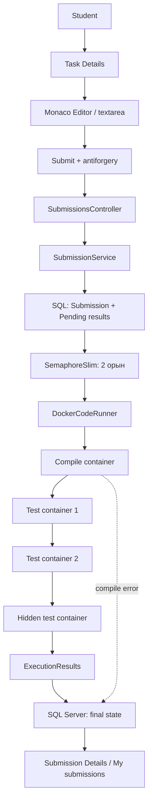
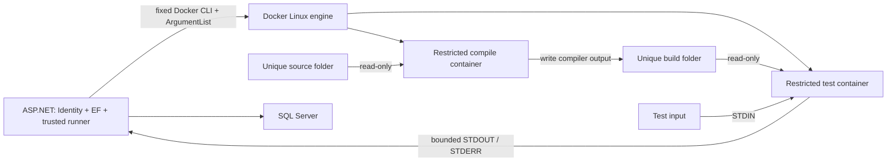

# Phase 3: код редакторы, жіберілімдер және Docker арқылы тексеру

Бұл құжат қолданыстағы ASP.NET Core MVC жобасының үшінші кезеңін түсіндіреді. Phase 1–2 модельдері, Identity, SQL Server, әкімшілік CRUD және ашық есептер сақталды. Жаңа entity, enum немесе migration қажет болған жоқ.

## 1. Phase 3-де не жасадық?

Есеп бетіне C++ редакторын, runtime таңдауын және Submit формасын қостық. Сервер жіберілген кодты базаға сақтайды, Docker ішінде компиляциялайды, сол есептің тесттерін орындайды және нәтижені көрсетеді. Пайдаланушы өз жіберілімдерінің тарихын қарай алады.

## 2. Code Editor қалай жұмыс істейді?

`Views/Tasks/_SubmissionForm.cshtml` қалыпты `SourceCode` textarea өрісін шығарады. Razor оның мазмұнын HTML ретінде кодтайды. `ClientScripts/code-editor.js` осы өрістің `.value` қасиетін оқып, Monaco-ға береді. Код JavaScript жолына немесе `innerHTML` ішіне біріктірілмейді.

Редактор қараңғы `vs-dark` тақырыбын, C++ синтаксисін және 420 px биіктікті қолданады. Әр өзгеріс textarea-ға көшіріледі; POST алдында тағы синхрондалады. Скрипт жүктелмесе, textarea арқылы код енгізу мүмкіндігі қалады. Бастапқы шаблонда тек `main` және түсініктеме бар, есептің дайын шешімі жоқ.

Draft `sessionStorage` ішінде пайдаланушы ID-і мен есеп ID-іне байланысты сақталады. Басқа есептің немесе басқа аккаунттың draft-ы осы формаға қосылмайды. Сервер validation қатесін қайтарғанда, нақты POST жасалған мәтін басым болады. Draft осы браузер қойындысына қатысты; бұл серверлік autosave емес.

## 3. Monaco Editor деген не?

Monaco — браузерге арналған код редакторы. Бұл жобада `monaco-editor` 0.57.0 және `esbuild` 0.28.2 нақты нұсқалары бекітілген. ESM редактор, C++ language definition және worker жергілікті `wwwroot/js/editor` бумасына жиналады. CDN қажет емес, student source сыртқы редактор сервисіне жіберілмейді.

`package-lock.json` тәуелділіктерді бекітеді. Дайын JS/CSS және лицензия файлдары жобада бар, сондықтан қолданбаны іске қосу үшін Node.js міндетті емес. Редактор кодын өзгертіп қайта жинағанда Node.js/npm керек:

```powershell
npm.cmd ci --ignore-scripts
npm.cmd run build:editor
```

Нұсқа туралы бастапқы дерек: [Monaco ресми releases](https://github.com/microsoft/monaco-editor/releases).

## 4. Submission деген не?

`Submission` — пайдаланушының бір есепке бір рет жіберген коды. Ол пайдаланушыны, есепті, runtime-ды, бастапқы кодты, тексеру күйін, тесттер санын және уақыттарды байланыстырады. `UserId` тек Identity claim арқылы алынады. Браузерден жіберілген `Status`, `UserId`, `PassedTests` сияқты қосымша өрістер нәтиже мәндерін басқара алмайды.

`SubmitViewModel` тек `ProgrammingTaskId`, `RuntimeId`, `SourceCode` мәндерін қабылдайды. Source міндетті, ең үлкен көлемі — UTF-8 бойынша 65 536 байт. Таңба саны мен байт саны бірдей болмауы мүмкін; қазақ әріптері бірнеше UTF-8 байт алады.

## 5. SubmissionStatus қалай өзгереді?

Қалыпты жол: `Pending → Compiling → Running → Accepted`.

Компиляция өтпесе — `CompilationError`. Барлық тест орындалып, кемінде біреуі өтпесе, тест реті бойынша алғашқы қате қорытынды күйді анықтайды: `WrongAnswer`, `RuntimeError`, `TimeLimitExceeded` немесе `MemoryLimitExceeded`. Docker/файл/инфрақұрылым қатесі не cancellation болса — мүмкіндігінше `InternalError` сақталады.

`CreatedAt` жіберілім құрылғанда, `StartedAt` семафордан орын алынғанда, `FinishedAt` аяқталғанда UTC түрінде жазылады. `CompileSucceeded`, `CompilerOutput`, `PassedTests`, `TotalTests` мәндерін сервер есептейді. Компиляцияға жетпеген жағдайда `CompileSucceeded` — `null`.

## 6. ExecutionResult деген не?

`ExecutionResult` бір жіберілім мен бір `TestCase` нәтижесін байланыстырады. Жіберіліммен бірге әр тестке `Pending` жазбасы құрылады. Одан кейін status, actual output, error, exit code және өлшенген уақыт жазылады. Компиляция өтпесе тесттер `Skipped` болады; инфрақұрылым қатесінде бір pending нәтиже `InternalError`, қалғаны `Skipped` болады.

Алдын ала жасалған байланыстар тексеру кезінде әкімшінің тестті тарихтан кездейсоқ өшіруіне FK арқылы кедергі болады. Орындауға тесттердің сол сәттегі көшірмесі алынады. Бұл кезеңде тест нұсқаларын бөлек архивтеу жүйесі жоқ.

`ExecutionTimeMs` Docker контейнерінің `StartedAt`–`FinishedAt` аралығынан алынады: бұл контейнердің **wall-clock** уақыты, дәл алгоритм CPU уақыты емес. Жіберілімдегі уақыт — өлшенген тест контейнерлері уақытының қосындысы. Кезекте күту мен компиляция бұл қосындыға кірмейді. Өлшем болмаса `null` қалады.

## 7. Runtime деген не?

Runtime — тіл туралы база жазбасы. Development seed бір `LanguageKey = "cpp"` жазбасын қосады: C++ 20, GCC 14.3.0, `.cpp`, enabled. Бұрыннан бар runtime қайта жазылмайды; `LanguageKey` үшін бұрыннан бар unique index қайталануды шектейді.

`CompileCommand`, `RunCommand`, `DockerImage` — орындалатын shell командалары емес. Сервер C# ішіндегі whitelist арқылы тек нақты `cpp` мәнін қабылдайды және `CodeRunnerOptions.Image` тұрақтысын қолданады. Базаға басқа команда немесе image жазу host-та оны орындауға мүмкіндік бермейді.

## 8. Неге әзірше тек C++ қолдандық?

Бір тілге арналған компиляция, орындалу және лимиттерді түсіну мен тексеру жеңіл. C++20 бір GCC image арқылы орындалады. Python, C# және өзге тілдер whitelist-ке кірмейді, runtime enabled болса да қабылданбайды.

## 9. Docker не үшін керек?

Docker компилятор мен студент бағдарламасын бөлек Linux процестері, файлдық көрініс және ресурстық шектер ішінде іске қосады. Host-қа тек Docker CLI іске қосылады. Docker Desktop Linux containers режимінде жұмыс істеуі және бекітілген image алдын ала жүктелуі керек.

Runner `docker info` арқылы Linux engine барын, `docker image inspect` арқылы image барын тексереді. Тексеру қысқа, 15 секундтық кэшті қолданады. Табылған image ID нақты контейнерге беріледі; әр тестте қайта pull болмайды. Docker жоқ болса host execution-ға ауысу болмайды.

## 10. Неге студент кодын ASP.NET серверінде тікелей іске қоспаймыз?

Студент коды шексіз цикл, көп процесс, үлкен жады сұрауы, шексіз output немесе файл/желіге қол жеткізу әрекетін қамтуы мүмкін. Оны веб-сервер процесінде іске қосу сервер деректеріне қауіп төндіреді. Сондықтан `ProcessStartInfo.FileName` тек белгілі орнату орнындағы Docker executable болады. Host-та `g++` немесе студенттің `program` файлы іске қосылмайды.

Docker шектеулері қауіп-қатерді азайтады, бірақ контейнер ортақ kernel қолданады. Бұл оқу жобасы Docker-ді мінсіз қауіпсіздік кепілі немесе көп жалға алушысы бар production judge деп көрсетпейді. Docker daemon-ға қатынау құқығы бар ASP.NET процесінің өзі сенімді бөлік болып саналады. [Docker қауіпсіздік моделі](https://docs.docker.com/engine/security/).

## 11. DockerCodeRunner қалай жұмыс істейді?

`DockerCodeRunner` health check, компиляция, бір тестті іске қосу, output салыстыру және container cleanup-ты орындайды. `DockerCli` тек процесті іске қосу мен ағындарды қауіпсіз оқуды біледі. `SubmissionService` бизнес ағынын және EF сақтауды басқарады.

`ProcessStartInfo.UseShellExecute = false`; барлық аргумент `ArgumentList` арқылы жеке беріледі. `cmd /c`, PowerShell немесе `sh -c` жоқ. SourceCode файлға жазылады, input STDIN арқылы беріледі. Олар shell командасының бөлігі болмайды.

## 12. Компиляция қалай орындалады?

Runner `gcc:14.3.0-bookworm` ресми GCC image-ін қолданады. Қолданылған pull digest:

```text
sha256:5e927c284bf55a7dc796262e311a0703344f62f41f5621eb56843111b1d37e15
```

`source/main.cpp` контейнерге `/source` ретінде read-only жалғанады. Тек өз жіберілімінің `build` бумасы `/build` ретінде writable болады. Тұрақты compiler командасы:

```text
/usr/bin/timeout --signal=TERM --kill-after=0.1s 15s
/usr/local/bin/g++ -std=c++20 -O2 -pipe -fdiagnostics-color=never /source/main.cpp -o /build/program
```

Бұл көрсетілім екі жолға бөлінгенімен, кодта әр бөлік жеке аргумент ретінде беріледі. Компиляция жады 512 MiB, CPU 1.0, ішкі timeout 15 секунд, host watchdog 20 секунд. `/tmp` tmpfs көлемі 128 MiB, root filesystem read-only. Нәтижеде кәдімгі `program` файлы жасалғаны тексеріледі.

## 13. TestCase қалай орындалады?

Тесттер `TestCase.Order` бойынша алынады. Әр тестке жаңа `ipp-run-<guid>` контейнері жасалады. Компиляциядан шыққан тек осы жіберілімнің `build` бумасы `/app` ретінде read-only жалғанады. Source бумасы runtime контейнеріне жалғанбайды.

Контейнер `/usr/bin/timeout` арқылы `/app/program` файлын іске қосады. Әр тест аяқталғанда контейнер жойылады. Бір студент орындаған контейнер екінші студентке қолданылмайды. Бір тест қате болса да келесі тесттер тексеріледі; жалпы жіберілім deadline-ы бұл жұмысты шектейді.

## 14. STDIN, STDOUT, STDERR деген не?

- STDIN — бағдарламаның кіріс ағыны; `TestCase.Input` осында жазылады.
- STDOUT — бағдарламаның жауабы; `ExpectedOutput` осы ағынмен салыстырылады.
- STDERR — диагностика ағыны; ол жауаппен араластырылмайды.

STDOUT пен STDERR қатар оқылады, сондықтан бір буфердің толуы екіншісін күтіп тұйықталмайды. Әр ағыннан ең көбі 64 KiB byte сақталады. Одан көп output анықталса Docker клиенті тоқтатылып, контейнер killed/removed болады; нәтиже `RuntimeError`, хабар `Output limit exceeded.` болады. Docker log driver `none`: студент output-ының бөлек шексіз daemon log файлы жасалмайды.

## 15. ExitCode деген не?

ExitCode — процесс аяқталғанда қайтарған сан. Әдетте `0` сәтті аяқталуды, өзгелері қате жағдайын білдіреді. Бағдарлама сәтті аяқталса ғана output салыстырылады. Runner timeout пен OOM белгілерін бөлек тексереді, содан кейін қалған нөлден өзгеше кодты `RuntimeError` деп белгілейді.

Тек `137` санынан OOM деп қорытынды жасалмайды. Ол басқа kill жағдайында да болуы мүмкін. Нақты exit code базада сақталады, бірақ hidden test беті оны артық техникалық дерек ретінде жарияламайды.

## 16. CompilationError қалай анықталады?

GCC нөлден өзгеше кодпен аяқталса, компиляция timeout/OOM/output limit болса, `CompileSucceeded = false`, status `CompilationError` болады. Компилятор диагностикасы шектеледі және уақытша host жолдары алынып тасталады. Барлық тест `Skipped`, `FinishedAt` UTC болып сақталады.

Docker CLI/daemon/image іске қосу қатесі компиляция синтаксисінің қатесімен араластырылмайды: ол `InternalError`. Студентке raw exception немесе Docker инфрақұрылым жолдары берілмейді; сервер logger-іне жазылады.

## 17. WrongAnswer қалай анықталады?

`NormalizeOutput` екі мәтіндегі `\r\n` және `\r` аяқталуларын `\n` түріне келтіреді, кейін `TrimEnd()` қолданады. Соңындағы бос орындар мен жаңа жолдар еленбейді. Басында тұрған бос орындар сақталады: `" 5"` пен `"5"` тең емес. Мәтіндердің қалған бөлігі дәл салыстырылады; token/numeric/floating-point checker жоқ.

## 18. TimeLimitExceeded қалай анықталады?

`TimeLimitMs` C# ішінде 100–30 000 ms аралығына clamp жасалады. GNU timeout сол мәнді тұрақты форматтағы сан ретінде алады. Алдымен TERM, 0.1 секундтан кейін қажет болса KILL қолданылады. Host watchdog тест шегіне қосымша 5 секунд береді; бұл Docker іске қосылуын да шектейді.

Timeout exit code және өлшенген уақыт үйлессе немесе host watchdog іске қосылса, `TimeLimitExceeded` сақталады. Контейнер `finally` ішінде force-remove болады. Қатар басқа MVC сұраулары async күту кезінде орындала береді.

## 19. MemoryLimitExceeded қалай бақыланады?

`MemoryLimitMb` 16–1024 MiB аралығына clamp жасалады. Docker `--memory` және дәл сондай `--memory-swap` мәнін алады: қосымша swap budget берілмейді. `docker inspect` нәтижесіндегі `State.OOMKilled` true болса ғана сенімді OOM белгісі ретінде `MemoryLimitExceeded` сақталады.

Жады сұрауы сәтсіз болып, бағдарлама өзінше басқа exit code қайтарса, ол міндетті түрде Docker OOM kill емес; онда `RuntimeError` болуы мүмкін. Peak memory өлшенбегендіктен `MemoryUsedKb = null`. Нақты өлшемнің орнына болжамды сан жазылмайды. [Docker resource constraints](https://docs.docker.com/engine/containers/resource_constraints/).

## 20. SourceCode қалай қауіпсіз сақталады?

EF Core кодты SQL параметрі арқылы `Submission.SourceCode` өрісіне сақтайды. ViewModel тек рұқсат етілген өрістерді қабылдайды. Identity authentication және жалпы MVC antiforgery filter POST сұрауын қорғайды. Request body үшін 512 KiB шегі, source үшін 64 KiB UTF-8 шегі бар.

Нәтиже бетінде source `<pre><code>@Model.SourceCode</code></pre>` арқылы encoded мәтін болады. `Html.Raw` қолданылмайды. Мысалы source ішіндегі `<script>` орындалмайды, код мәтіні ретінде көрсетіледі.

## 21. Temporary directory не үшін керек?

Әр жіберілімге сервер жасаған GUID бумасы қажет:

```text
Path.GetTempPath()/IntelligentProgrammingPlatformRunner/
└── <32 таңбалы GUID>/
    ├── source/main.cpp
    └── build/program
```

Username, email, есеп атауы немесе source файл жолын анықтамайды. Mount пен delete алдында жолдың осы root ішіндегі GUID/source немесе GUID/build екені тексеріледі. Windows-та бұл әдетте пайдаланушының `%TEMP%` бумасы.

Контейнер `finally` арқылы `docker rm --force <generated-name>` командасымен жойылады; timeout/cancellation кезінде де cleanup жеке token арқылы жүреді. Жіберілімнің `finally` бөлігі source/build бумасын жояды. Қате болса серверге log жазылады. Docker daemon не диск істемей қалғанда cleanup-тың абсолют кепілі жоқ; осы кезеңде background reaper жасалған жоқ.

## 22. --network none не істейді?

Контейнер сыртқы желіге жалғанбайды; тек өзінің loopback интерфейсі болады. Web-серверге, SQL Server-ге, интернетке арналған network route берілмейді. Docker socket та mount жасалмайды. Бұл талап compile және run контейнерлеріне бірдей қолданылады. [Docker run network options](https://docs.docker.com/engine/containers/run/).

## 23. --memory не істейді?

Контейнердегі барлық процестер үшін cgroup memory шегін орнатады. Бұл тек `main` ішіндегі бір массивтің шегі емес: процесс, кітапхана және басқа container memory қолданысы да есепке кіреді. Компиляция үшін тұрақты 512 MiB, тест үшін clamp жасалған есеп шегі пайдаланылады.

## 24. --cpus не істейді?

Контейнерге CPU уақытын шектейді. Компилятор 1.0, тест 0.5 CPU quota алады. `0.5` «екі есе тез/баяу дәл өлшем» емес; жоспарлаушыға берілетін шек. Уақыт лимиті wall-clock бойынша болғандықтан, CPU quota нәтижеге әсер етуі мүмкін.

## 25. --pids-limit не істейді?

`--pids-limit 64` контейнердің процесс/thread санын шектейді. Бұл fork/thread арқылы host процестерін шексіз толтыру қаупін азайтады. Бұған timeout және init процестері де кіреді. `--init` orphan/zombie процестерін жинауға көмектеседі.

## 26. --cap-drop ALL не үшін керек?

Linux capabilities — арнайы kernel құқықтары. Барлығын алып тастау контейнер процесіне әдеттегі бағдарламаны орындауға қажет емес артық құқықтарды бермейді. Қосымша `--user 65534:65534` арқылы compile/run root пайдаланушысымен орындалмайды; privileged режим жоқ. Docker-дің default seccomp профилі өшірілмейді.

## 27. no-new-privileges не үшін керек?

Бұл процесс кейін executable ауыстырғанда қосымша құқық алуын шектейді. Оған қоса root filesystem read-only; writable `/tmp` tmpfs `noexec,nosuid,nodev` параметрлерімен жасалады. Compile tmpfs 128 MiB, run tmpfs 16 MiB. Core dump өшірілген, open files 64, файл көлемі 16 MiB арқылы шектеледі. Қажетті `/build` жазу құқығы тек компилятор контейнерінде болады. [Docker container run анықтамасы](https://docs.docker.com/reference/cli/docker/container/run/).

## 28. Hidden tests нәтижелері неге жасырылған?

Жасырын input/expected output студентке алдын ала дайын жауап жазуға мүмкіндік бермеуі керек. Ашық Task Details тек `!IsHidden` мысалдарын SQL projection арқылы алады. Hidden мәндер ViewModel, HTML, script, JSON немесе data атрибуттарына қосылмайды.

Submission Details SQL projection-ы hidden тесттің input, expected, actual, stderr/error және memory мәндерін `null` етеді. Бетте тек тест нөмірі, hidden белгісі, status және уақыт бар. Actual output-ты жасыру маңызды: бағдарлама input-ты қайта басып шығарып, сол арқылы hidden деректі ашуға тырысуы мүмкін.

## 29. Student неге басқа студент submission-ын көре алмайды?

`SubmissionsController` түгел `[Authorize]` арқылы қорғалған. `My` мен `Details` сұраулары базадан дерек аларда `Submission.UserId == currentUserId` шартын қолданады. Басқа адамның ID-ін URL-ге енгізу 404 қайтарады. Бұл тек сілтемені UI-ден жасыру емес.

Осы нұсқада Admin үшін де ownership шарты өзгермейді: басқа пайдаланушының submission-ын қарайтын ерекше Admin bypass қосылған жоқ. Нәтиже беттері `NoStore` арқылы response caching-тен қорғалған. History 20 жазбадан беттеледі, жаңа жіберілім бірінші көрсетіледі.

## 30. SemaphoreSlim не үшін қолданылды?

Singleton `SubmissionExecutionGate` бір ASP.NET процесінде ең көбі екі жіберілімді қатар орындайды. Бір жіберілім бір мезетте бір контейнерді қолданады, сондықтан осы runner-дің бір процестегі контейнер саны да шектеледі. Бос орын 10 секунд күтіледі; орын болмаса safe `InternalError` сақталады.

Бүкіл жіберілімге 180 секунд deadline бар. Ең көбі 100 тест, бір тесттің input/expected output көлемі ең көбі 1 MiB UTF-8. Семафор бөлек серверлер арасында ортақ емес. Бұл жерде distributed queue, Redis немесе microservice жоқ. Request үзілгенде не қолданба қалыпты тоқтағанда cancellation контейнер cleanup-ына жетеді.

## 31. Phase 2 мен Phase 3 қалай байланысады?

Phase 2 Identity арқылы пайдаланушыны таниды, Admin есептер мен тесттерді басқарады, студент жарияланған есептерді оқиды. Phase 3 сол есептердің тесттерін орындауға қолданады. Existing enum/entity/FK құрылымы жеткілікті болды.

`SubmissionService` алдымен қысқа `SaveChangesAsync` арқылы submission/result placeholders сақтайды. Docker жүріп жатқанда SQL transaction ашық ұсталмайды. Әр нәтиже қысқа сақтау операциясымен жаңартылады. Соңғы күй request token-ынан тәуелсіз 10 секундтық save token арқылы сақталуға тырысады. Қолданба күштеп өлтірілсе не база қолжетімсіз болса, аяқталмаған күй қалуы мүмкін; durable background jobs осы кезеңнің бөлігі емес.

## 32. Phase 4-те не жасалады?

Келесі кезеңнің мүмкін жұмыстары — AI tutor, hints, explanations, progress/statistics және leaderboard есептеу. **Бұл мүмкіндіктер Phase 3-те іске асырылған жоқ.** OpenAI интеграциясы, recommendation engine, achievements, competitions, Kubernetes және толық UI redesign қосылған жоқ.

## Орындау ағыны



Әр compile/run контейнері аяқталған соң жойылады; барлық жолда `finally` cleanup жасалады. Диаграмма негізгі сәтті жолды көрсетеді; нақты кодта exception, timeout және cancellation өңделеді.

## Қауіпсіздік шекарасы



Студент бағдарламасына SQL connection string, Identity secrets, ASP.NET жоба бумасы, user home, Docker socket немесе host disk root берілмейді. Runtime-ға тек өз executable бумасы read-only беріледі. Бағдарламада сыртқы network route жоқ. Docker daemon-ды басқару тек сенімді host runner жағында қалады.

## Кодтағы комментарийлер

Authored C# әдістерінің, конструкторлардың, controller action-дардың, private helper, validation, seed, runner және cleanup әдістерінің үстіне қысқа қазақша purpose-комментарийлер қосылды. Phase 1–2 әдістеріне комментарий қосу үшін олардың жұмыс логикасы өзгертілмеді. `Program.cs` маңызды конфигурация бөлімдеріне де қазақша түсіндірме қосылды. Тексерілген authored әдіс/конструктор саны: 87.

`Migrations/InitialCreate`, designer және model snapshot — EF жасаған generated файлдар. Оларды қолмен өзгертпеу талабы сақталды; комментарийлер үшін де өзгертілген жоқ. Қасиеттің әр жолына, әр айнымалыға немесе brace-ке түсініктеме қосылмады.

## Файлдар мен қызметтер

| Файл немесе бума | Міндеті |
|---|---|
| `Controllers/SubmissionsController.cs` | Submit, My, Details және ownership |
| `Services/Submissions/SubmissionService.cs` | Validation, сақтау, status және орындалу ағыны |
| `Services/Submissions/SubmissionExecutionGate.cs` | Ортақ екі орындық семафор |
| `Services/Submissions/TaskPageService.cs` | Қауіпсіз ашық есеп ViewModel-і |
| `Services/CodeExecution/DockerCodeRunner.cs` | Compile/run, Docker шектері, салыстыру, cleanup |
| `Services/CodeExecution/DockerCli.cs` | Fixed executable, ArgumentList, timeout, bounded streams |
| `Services/CodeExecution/SubmissionWorkspace.cs` | GUID source/build бумалары |
| `Services/CodeExecution/CodeRunnerOptions.cs` | Trusted image және қауіпсіз лимиттер |
| `Services/CodeExecution/CompileResult.cs`, `TestRunResult.cs` | Орындау нәтижесінің қарапайым record-тары |
| `ViewModels/Submissions/` | Submit validation, Details және History DTO-лары |
| `Views/Submissions/`, `Views/Tasks/_SubmissionForm.cshtml` | Редактор формасы, тарих және нәтиже |
| `ClientScripts/code-editor.js` | Monaco, қауіпсіз sync және draft |
| `scripts/build-editor.mjs`, `package.json`, `package-lock.json` | Жергілікті editor bundle құру |
| `wwwroot/js/editor/` | Дайын JS/CSS/worker және лицензиялар |
| `scripts/verify_phase3.py` | Нақты HTTP, SQL және Docker интеграциялық тексерулер |

`Program.cs`, `Data/DbSeeder.cs`, `Controllers/TasksController.cs`, `TaskDetailsViewModel`, Task Details, login navigation және site CSS жаңа ағынға қосылды. Қалған бұрынғы C# өзгертулері — түсіндірме комментарийлер.

## Жергілікті іске қосу

Docker Desktop Linux engine іске қосылған болуы керек. Жоба қолданатын SQL Server/Identity/Development admin User Secrets баптаулары Phase 2-дегідей қалады. Құпия сөзді репозиторийге жазудың қажеті жоқ.

Бекітілген image бір рет жүктеледі; web app оны автоматты pull жасамайды:

```powershell
docker --version
docker info
docker pull gcc:14.3.0-bookworm
dotnet build
dotnet ef migrations has-pending-model-changes --no-build
dotnet ef database update --no-build
dotnet run --no-build --launch-profile https -- --Logging:LogLevel:Microsoft.EntityFrameworkCore.Database.Command=Warning
```

Браузерде `https://localhost:7115`, кіру/тіркелу, есепті ашу, код жазу және Submit. Бұрынғы admin конфигурациясы бар болса оны қайта жасау керек емес. Runner стандартты Windows Docker Desktop executable жолдарын (Program Files немесе LocalAppData/Programs/DockerDesktop) және Linux `/usr/bin/docker`, `/usr/local/bin/docker` жолдарын біледі. Басқа орнату орнында fixed server-side жолды әзірлеуші тексеріп түзетуі керек; браузерден executable path қабылданбайды.

Қолданба ашық тұрған екінші терминалда:

```powershell
python scripts/verify_phase2.py
python scripts/verify_phase3.py
```

Скрипттер loopback Development HTTPS сертификатын қабылдайды, нақты cookies/antiforgery token қолданады және тек өздерінің GUID-пен белгіленген fixture деректерін жояды. Phase 3 скриптінде студент source тек web app арқылы Docker-ге жіберіледі. SQL/Docker командаларына жергілікті тиісті қолжетімділік қажет.

## Тексеру нәтижелері мен шектер

2026-09-30 күнгі нақты тексеру: негізгі Phase 3 suite **13 жіберіліммен толық өтті**. Қолжетімсіз Docker endpoint-пен бөлек екі жіберілім тексерілді. Verification аккаунттары, жіберілімдері және қосымша тест деректері соңында жойылды; бұрынғы пайдаланушы деректері сақталды.

| Тексеру | Нақты нәтиже |
|---|---|
| Екі санды дұрыс қосу, CRLF және соңындағы бос орындар | Accepted, барлық тест Passed |
| Қате жауап | WrongAnswer |
| Синтаксистік қате | CompilationError, барлық тест Skipped |
| Шексіз цикл | TimeLimitExceeded, контейнер тоқтатылды |
| Бағдарлама `return 42` | RuntimeError |
| Шексіз STDOUT | RuntimeError, Output limit exceeded, сақталған output шектеулі |
| Жадыны үздіксіз бөлу және қолдану | MemoryLimitExceeded, Docker OOM белгісі |
| Жауаптың басындағы артық бос орын | WrongAnswer; TrimStart қолданылмаған |
| Үш қатар сұрау | Барлығы аяқталды; бір мезетте ең көбі екі runner контейнері |
| Орындалып жатқан HTTP сұрауын үзу | InternalError, FinishedAt сақталды, cleanup өтті |
| DB CompileCommand/RunCommand/DockerImage мәндерін уақытша өзгерту | Trusted runner өзгермеді, дұрыс код Accepted; metadata қалпына келтірілді |
| Docker endpoint қолжетімсіз және кэштелген қайталама қате | Екі InternalError, raw exception бетте жоқ, host fallback жоқ |
| Екінші студенттің Details және My сұрауы | Өзгенің Details-і 404; history-де бөтен жіберілім жоқ |
| Hidden input/expected/actual | Толық HTML ішінде жоқ |
| Source ішіндегі script мәтіні | Encoded мәтін, орындалатын HTML емес |
| Бос/үлкен/UTF-8 бойынша үлкен source, runtime және task ID | Сервер validation; жарамсыз source базаға жіберілім жасамады |
| Compile және run контейнерлерін live inspect | Network none, non-root, caps, read-only, mounts, memory/swap, CPU, PID, tmpfs, no-new-privileges тексерілді |
| Шексіз цикл кезіндегі `/Tasks` | HTTP 200, тексерілген әр сұрау 2 секундтан аз |
| Сәтті/қате/timeout/cancellation соңындағы cleanup | Phase 3 контейнерлері 0, жіберілім temp бумалары 0 |
| Phase 2 regression | Identity, Admin CRUD, public/hidden tests және FK protection тексерулері толық өтті |
| Соңғы `dotnet build` | 0 error, 0 warning |
| EF pending model changes | Жоқ; migration жасалмады |
| EF database update | База жаңартылған, қолданатын migration жоқ |
| Docker | Client/Server 29.6.2, Linux engine қолжетімді |

Қолжетімсіз Docker сынағы кезінде Docker Desktop тоқтатылған жоқ. Тек тестке арналған ASP.NET процесінің `DOCKER_HOST` мәні жоқ named pipe-қа бағытталды. Кейін ол процесс тоқтатылып, қалыпты ортадағы қолданба қайта іске қосылды. Осы арнайы тексерудің командалары:

```powershell
$env:DOCKER_HOST = 'npipe:////./pipe/ipp-unavailable-verification'
dotnet run --no-build --launch-profile https -- --Logging:LogLevel:Microsoft.EntityFrameworkCore.Database.Command=Warning
# Бөлек, қалыпты DOCKER_HOST ортасы бар терминалда:
python scripts/verify_phase3.py --unavailable
```

Жоғарыдағы уақытша орта айнымалысын күнделікті іске қосуда қолданбаңыз. Арнайы тест терминалын жапқанда оның мәні жойылады; жаһандық Docker конфигурациясы өзгертілген жоқ.

Алғашқы editor жинауында нақты орындалған командалар: `npm.cmd install --ignore-scripts`, `npm.cmd run build:editor`. Npm орнату кезінде 0 vulnerability хабарлады. `git diff --check` whitespace қатесін таппады; Windows line-ending туралы Git хабарламалары compiler warning емес. `InitialCreate` және model snapshot өзгеріссіз.

Визуалды Monaco QA үшін браузерді қолмен ашып тексеру қажет: осы агент сессиясында browser automation ешқандай браузер бетін ұсынбады. Local JS/CSS/worker HTTP арқылы берілуі, encoded textarea және form validation бөлек тексерілді; бұл визуалды render сынағын алмастырмайды. Контейнерлер Windows Docker Desktop Linux engine-де сыналды; Linux host файл рұқсаттары коды бар, бірақ бөлек Linux host-та E2E орындалған жоқ.
